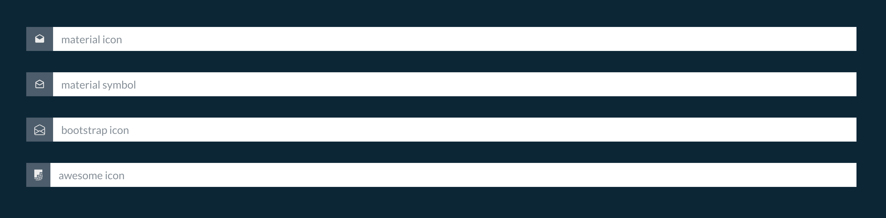

---
hide:
    - navigation
---

#


## Themes

The project [dash-bootstrap-components](https://dash-bootstrap-components.opensource.faculty.ai/){:target=_blank}
    provides a [library of themes](https://dash-bootstrap-components.opensource.faculty.ai/docs/themes/explorer/){:target=_blank}.
    You can use it. For faster access we provide a Enum object at the property skyant.ui.app.Bootstrapped.themes
    
::: skyant.ui.app._dash.Themes
    options:
        show_root_heading: false
        heading_level: 0

```py linenums='1' title='index.py'
#!/usr/bin/env python3.10

from skyant.ui.app import Bootstrapped

app = Bootstrapped(
    'Name',
    default_theme=Bootstrapped.theme.SUPERHERO
)

if __name__ == '__main__':
    app.run_server(host='0.0.0.0', port=8008)
```


## Fonts

The object skyant.ui.app.Bootstrapped loads next Google Fonts:

- [Comfortaa](https://fonts.google.com/share?selection.family=Comfortaa:wght@300;400;600;700){:target=_blank}

    _normal; 300; 400; 600; 700_

- [Montserrat](https://fonts.google.com/share?selection.family=Montserrat:ital,wght@0,100;0,200;0,400;0,600;1,100;1,200;1,400;1,600){:target=_blank}

    _normal, italic; 0,100; 0,200; 0,400; 0,600; 1,100; 1,200; 1,400; 1,600_

- [Roboto](https://fonts.google.com/share?selection.family=Roboto:ital,wght@0,100;0,300;0,500;1,100;1,300;1,500){:target=_blank}

    _normal, italic; 0,100; 0,300; 0,500; 1,100; 1,300; 1,500_


You can use they fonts with no additional action.

```py linenums='1' title='index.py'
#!/usr/bin/env python3.10

from dash import html
from skyant.ui.app import Bootstrapped

app = Bootstrapped(
    'Name',
    default_theme=Bootstrapped.theme.SUPERHERO
)

app.layouter([
    html.H1(
        'Demo Title',
        style={'font-family': 'Comfortaa'}
    )
])

if __name__ == '__main__':
    app.run_server(host='0.0.0.0', port=8008)
```

Or upload more.
```css linenums='1' title='assets/your.css'
@import url('https://fonts.googleapis.com/css2?family=Comfortaa:wght@300;400;600;700&display=swap');
```

```py linenums='1' title='index.py'
#!/usr/bin/env python3.10

from skyant.ui.app import Bootstrapped

app = Bootstrapped(
    'Name',
    default_theme=Bootstrapped.theme.SUPERHERO,
    external_stylesheets='https://example.com/assets/your.css'
)

if __name__ == '__main__':
    app.run_server(host='0.0.0.0', port=8008)
```


## Icons & Symbols

You might use predefined icons such as:

- Google Material [Icons](https://fonts.google.com/icons?icon.set=Material+Icons){target=_blank} & [Symbols](https://fonts.google.com/icons?icon.set=Material+Symbols){target=_blank}

- [Bootstrap Icons](https://icons.getbootstrap.com/){target=_blank}

- [Awesome Icons](https://fontawesome.com/icons){:target=_blank}

=== "code"

    ```py linenums='1' title='index.py'
    #!/usr/bin/env python3.10

    from dash import html
    import dash_bootstrap_components as dbc
    from skyant.ui.app import Bootstrapped


    app = Bootstrapped(
        'Name',
        default_theme=Bootstrapped.theme.SUPERHERO
    )

    app.layouter([
        dbc.InputGroup(
            [
                dbc.InputGroupText(
                    'drafts',
                    style={'font-family': 'Material Icons'}
                ),
                dbc.Input(placeholder="material icon")
            ],
            className="mb-3 px-5 pt-5 pb-2",
        ),

        dbc.InputGroup(
            [
                dbc.InputGroupText(
                    'drafts',
                    style={'font-family': 'Material Symbols Outlined'}
                ),
                dbc.Input(placeholder="material symbol")
            ],
            className="mb-3 px-5 py-2",
        ),

        dbc.InputGroup(
            [
                dbc.InputGroupText(
                    '',
                    class_name='bi bi-envelope-open'
                ),
                dbc.Input(placeholder="bootstrap icon")
            ],
            className="mb-3 px-5 py-2",
        ),

        dbc.InputGroup(
            [
                dbc.InputGroupText(
                    '',
                    class_name='fa-brands fa-firstdraft'
                ),
                dbc.Input(placeholder="awesome icon")
            ],
            className="mb-3 px-5 py-2",
        )

    ])

    if __name__ == '__main__':
        app.run_server(host='0.0.0.0', port=8008)
    ```

=== "result"

    { align=center }


## Favicon

The Dash serves as a browser favicon the file assets/favicon.png.

If you want to use a corporate (centralized) version of the favicon, you can set the
    environment variable FAVICON_URL. In this case skyant.ui.app.Bootstrapped loads the
    favicon during build an self instance.